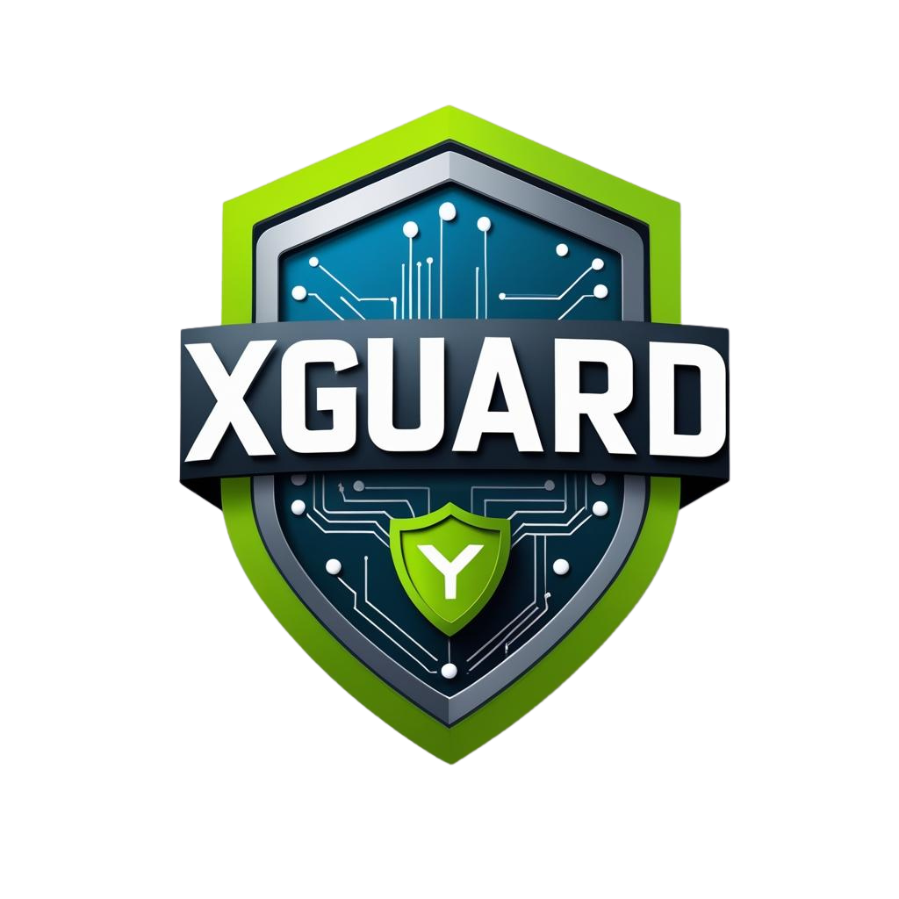

# Xguard-Xion: ISO 20022 Wallet Validator  

  

---

## Overview  
**Xguard-Xion** is an open-source, stateless, InfoSec-safe validator for **Xion wallet addresses** and **Real World Asset (RWA) contracts** using FastAPI.  
It is designed to bridge **Web3 ↔ Traditional Finance** by offering wallet safety, AI risk scoring, and **ISO20022 XML exports** for compliance and institutional adoption.  

---

## Features  

- Validate any Xion wallet address (balance, tx count, failed txs, anomaly flag).  
- Transparent AI/heuristic risk scoring (score 0–100).  
- SQLite metrics logging (timestamp, address, duration, score, status).  
- `/metrics` endpoint for validation stats.  
- `/rwa/assets` endpoint fetches live RWA contract data (CosmWasm).  
- `/iso/pain001.xml` endpoint exports results in ISO 20022 XML format.  
- Simple dark mode web UI with neon green and orange accents.  
- Security middleware: headers, input validation, rate limit (no PII, no keys).  

---

## Architecture  

                   ┌─────────────────────────┐
                   │       User / Client      │
                   │  - Web UI (Dark mode)    │
                   │  - Mobile-first access   │
                   └─────────────┬───────────┘
                                 │
                                 ▼
                   ┌─────────────────────────┐
                   │   FastAPI Backend API   │
                   │  - Input validation     │
                   │  - Rate limiting        │
                   │  - Secure headers (TLS) │
                   │  - No PII stored        │
                   └─────────────┬───────────┘
                                 │
        ┌─────────────────────────────────────────────────┐
        │                 Core Modules                    │
        │                                                 │
        │  Wallet Validation ────────┐                    │
        │  - Address check            │                    │
        │  - Balance & tx count       │                    │
        │  - Anomaly detection        │                    │
        │                             │                    │
        │  Risk Engine ───────────────┼─> AI/heuristics    │
        │  - Score 0–100              │                    │
        │  - Flags suspicious wallets │                    │
        │                             │                    │
        │  RWA Module ────────────────┼─> CosmWasm query   │
        │  - Live asset contracts     │                    │
        │  - Future tokenization      │                    │
        │                             │                    │
        │  ISO Export ────────────────┼─> pain.001, pacs.008│
        │  - XML reports for banks    │                    │
        │                             │                    │
        │  Metrics Logger ────────────┼─> SQLite (stateless│
        │  - Timestamp, address, score│                    │
        └─────────────────────────────┘                    │
                                 │
                                 ▼
                   ┌─────────────────────────┐
                   │   RPC Endpoint Layer    │
                   │  - 5 fallback providers │
                   │  - Cosmos SDK REST      │
                   │  - Circuit breaker      │
                   └─────────────┬───────────┘
                                 │
                                 ▼
                   ┌─────────────────────────┐
                   │   Xion Blockchain       │
                   │  - Mainnet / Testnet    │
                   │  - CosmWasm contracts   │
                   └─────────────────────────┘

---

## Directory Structure  

/app.py                # FastAPI entrypoint  
/xion_handler.py       # Wallet validation with fallback RPC/REST endpoints  
/risk_engine.py        # AI/heuristic risk scoring (transparent)  
/rwa_handler.py        # CosmWasm smart-query for live RWA contracts  
/iso_export.py         # ISO 20022 XML export (pain.001, pacs.008)  
/metrics.py            # SQLite logging: timestamp, address, duration, score, status  
/utils.py              # Helpers + fallback rotation  
/templates/index.html  # Dark UI, dashboard  
/static/style.css      # Dark + neon green/orange accents  
/static/Xguard-logo.png# Logo placeholder  
/requirements.txt  
/README.md  
/LICENSE  

---

## Live Deployments  

- 🌐 **Xguard-Xion** → https://xguard-xion.onrender.com  
- 🌐 **CryptoGuard (XRPL)** → https://adc-assetguard-ai.onrender.com  
- 🌐 **GuardianX (Kadena)** → https://gx-kadena.onrender.com  
- 🌐 **HGuard (Hedera)** → https://hguard-hedera.onrender.com  
- 🌐 **ProetorX (XRPL tailored)** → https://proetorx-xrpl.onrender.com  

---

## Traction & Validation  

- **1,100+ wallet validations** completed across 700+ unique addresses.  
- **Live deployments** across 4 ecosystems (XRPL, Hedera, Kadena, Xion).  
- **SonarQube audit passed** – ✅ Quality Gate, no critical issues.  
- **Recognized by RippleX Partner Success (Aurélie Dhellemmes)** on ISO20022 relevance →  
  [Proof](https://www.linkedin.com/feed/update/urn:li:activity:7365880664300146688?commentUrn=urn%3Ali%3Acomment%3A%28activity%3A7365880664300146688%2C7365885925588877313%29&replyUrn=urn%3Ali%3Acomment%3A%28activity%3A7365880664300146688%2C7366108455981461504%29&dashCommentUrn=urn%3Ali%3Afsd_comment%3A%287365885925588877313%2Curn%3Ali%3Aactivity%3A7365880664300146688%29&dashReplyUrn=urn%3Ali%3Afsd_comment%3A%287366108455981461504%2Curn%3Ali%3Aactivity%3A7365880664300146688%29)  

---
## InfoSec & Compliance

- **Stateless Design**: No private keys, seed phrases, or user PII stored.  
- **Secure Middleware**: Enforced HTTP security headers, input validation, and rate limiting.  
- **Transport Security**: TLS 1.3 enforced (via Render hosting).  
- **Code Quality**: Continuous scanning with SonarQube → Quality Gate Passed (A rating).  
- **Fallback RPC Rotation**: Mitigates endpoint DoS and ensures uptime.  
- **Audit-Ready Outputs**: ISO 20022 XML exports (pain.001, pacs.008) can be integrated into financial compliance systems.  
- **GDPR & Privacy**: Only non-sensitive metadata (wallet address, timestamp, status) logged in SQLite.  

> Security-first principle: Validator is read-only, no signing or asset custody.

---
## Roadmap (6 months)  

- **Month 1–2**: Stabilize validator core, fallback RPCs, refine AI risk scoring  
- **Month 2–3**: Integrate **RWA module** and ISO20022 XML reporting  
- **Month 4–5**: Security audit, stress testing, bug fixes  
- **Month 6**: Mainnet launch with enterprise pilot partners  

---

## Budget Request (Thrive XION)  

💰 **USD 70,000** (above $50k cap, due to compliance & audit costs)  

| Category             | Amount (USD) | Notes |
|----------------------|--------------|-------|
| Engineering (backend, AI risk, RWA) | 28,000 | Founder + dev support |
| Compliance & ISO Integration        | 15,000 | XML standards, audit-ready |
| Security & SonarQube Audits         | 10,000 | External + SonarCloud |
| Infrastructure & Deployment         | 7,000  | Render, RPC fallback infra |
| Founder Compensation (full-time)    | 10,000 | To ensure focus for 6 months |

---

## Team  

- **Muhammad Yusri Adib (Founder/CTO)**  
  LinkedIn: [https://www.linkedin.com/in/yusri-adib-455aa8b7](https://www.linkedin.com/in/yusri-adib-455aa8b7)  

- **Muhammad Mustafa Abdulmanaf (Advisor, Compliance/Audit)**  
  LinkedIn: [https://www.linkedin.com/in/muhammad-mustafa-abdulmanaf](https://www.linkedin.com/in/muhammad-mustafa-abdulmanaf)  

---

## Install & Run  

Python 3.9+ recommended.  

```bash
pip install -r requirements.txt
uvicorn app:app --reload
```

Visit http://localhost:8000

---

## Disclaimer
- MVP only. No financial advice.
- Stateless, no private keys or user data stored.
- RWA data accuracy depends on upstream CosmWasm contracts.
- ISO export for experimentation only.

MIT License.

---
